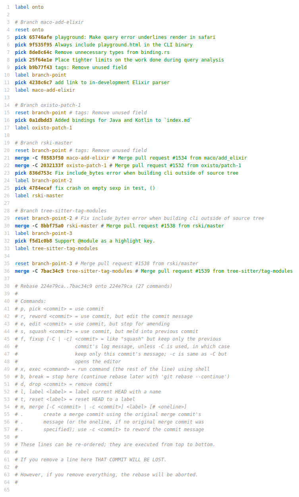

# `tree-sitter-git-rebase`

A [tree-sitter](https://tree-sitter.github.io/tree-sitter/) grammar for git's interactive rebase file.

### Status

It's working! But needs more testing.

### Example

With the [Helix](https://github.com/helix-editor/helix) editor:

